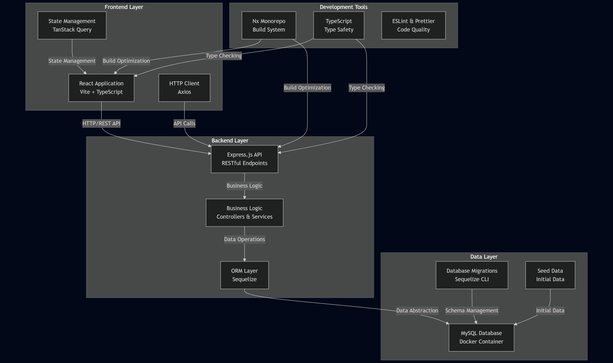

# 0000-fsams-redvalley-clinicalplatform
Red Valley Test
=================================

## 🏗️ Arquitectura del Sistema
-----------------



📋 Prerrequisitos
-----------------
- Node.js 18+ (recomendado 20+)
- Docker Desktop con Docker Compose v2
- npm 9+ o yarn 1.22+

🚀 Configuración Inicial
-----------------------
1) Instalación de dependencias
```bash
# Instalar todas las dependencias del workspace
npm install
```

2) Infraestructura con Docker
```bash
# Levantar base de datos MySQL
docker compose up -d

# Verificar que los contenedores estén ejecutándose
docker compose ps
```

3) Configuración de base de datos
```bash
# Ejecutar migraciones
npx sequelize-cli db:migrate

# Poblar datos iniciales
npx sequelize-cli db:seed:all
```

4) Variables de entorno
Crea el archivo **.env** en la **raíz** del proyecto (basado en `.env.example`):

```ini
# Servidor
PORT=3000
NODE_ENV=development

# Base de Datos MySQL
DB_HOST=localhost
DB_PORT=3306
DB_NAME=clinical_platform
DB_USER=clinical_user
DB_PASS=clinical_pass

# Configuraciones Adicionales
CORS_ORIGIN=http://localhost:5173
LOG_LEVEL=info
```

Frontend (`web/.env.development`):
```ini
VITE_API_URL=http://localhost:3000
```

🎯 Inicio Rápido (Desarrollo)
----------------------------
**Opción 1: Servicios por separado**
```bash
# Terminal 1: Backend API
npm run dev:api

# Terminal 2: Frontend Web (Vite)
npm run dev:web
```

**Opción 2: Ambos servicios**
```bash
# Levanta backend y frontend simultáneamente (requiere 'concurrently')
npm run dev:all
```

**URLs de Desarrollo**
- API Backend: http://localhost:3000
- Frontend Web (Vite): http://localhost:5173
- Health Check: http://localhost:3000/health

📚 Scripts Disponibles
----------------------
**Desarrollo**
```bash
npm run dev:api          # Servidor API (Nx serve)
npm run dev:web          # Servidor frontend (Vite)
npm run dev:all          # Ambos servidores simultáneamente
```

**Base de Datos**
```bash
npm run compose:up       # Levantar infraestructura Docker
npm run compose:down     # Detener contenedores
npm run db:migrate       # Ejecutar migraciones
npm run db:seed          # Ejecutar seeds
npm run db:reset         # Reset completo (down all -> migrate -> seed)
```

**Build y utilidades**
```bash
npm run build:api        # Build del backend
npm run build:web        # Build del frontend
npm run lint             # Análisis ESLint
npm run format           # Formateo con Prettier
npm run graph            # Visualizador de dependencias Nx
```

🔌 API Endpoints
----------------
**Gestión de Pacientes**
- `GET /patients` – Listar pacientes
- `GET /patients/:id` – Obtener paciente específico
- `POST /patients` – Crear nuevo paciente
- `POST /patients/:id/assign-provider` – Asignar proveedor
- `POST /patients/:id/change-status` – Cambiar estado
- `GET /patients/:id/history` – Historial del paciente

**Catálogos y Referencias**
- `GET /statuses` – Lista de estados médicos
- `GET /statuses/tree` – Árbol jerárquico de estados
- `GET /providers` – Lista de proveedores médicos

**Utilidades**
- `GET /health` – Health check del sistema

🏗️ Estructura del Proyecto
--------------------------
> Nota: este workspace Nx usa proyectos *standalone*. Las carpetas principales son `/api` (backend) y `/web` (frontend).

```
clinical-platform/
├─ api/                       # Backend Express + Sequelize
│  ├─ src/
│  │  ├─ app/                 # Rutas y controladores
│  │  ├─ config/              # Carga de .env
│  │  └─ infra/
│  │     └─ db/
│  │        ├─ models/        # Modelos Sequelize
│  │        └─ sequelize.ts   # Instancia de Sequelize
│  └─ sequelize/
│     ├─ config/              # Config CLI de Sequelize
│     ├─ migrations/          # Migraciones
│     └─ seeders/             # Seeders (statuses, providers)
├─ web/                       # Frontend React (Vite + Tailwind)
│  ├─ src/
│  │  ├─ features/            # Módulos de UI (patients, providers, statuses)
│  │  ├─ components/          # Componentes reutilizables
│  │  ├─ lib/                 # Axios client, utilidades
│  │  └─ types.ts             # Tipos compartidos del FE
├─ docker-compose.yml
├─ package.json
├─ nx.json
├─ tsconfig.base.json
└─ README.md (este archivo)
```

✅ Buenas Prácticas Implementadas
-------------------------------
**Seguridad**
- ✅ CORS configurado para desarrollo (`http://localhost:5173`)
- ✅ Validación de datos en endpoints
- ✅ Transacciones para operaciones críticas
- ✅ Variables de entorno no versionadas (`.env`, `.env.example`)

**Calidad de Código**
- ✅ TypeScript en frontend y backend
- ✅ ESLint y Prettier para consistencia
- ✅ Separación de responsabilidades (rutas/servicios/modelos)
- ✅ Manejo de errores con respuestas 4xx/5xx claras

**Base de Datos**
- ✅ Migraciones para control de esquema
- ✅ Seeds para datos de referencia
- ✅ ORM (Sequelize) para abstracción
- ✅ Transacciones para consistencia

**Desarrollo**
- ✅ Hot reload en desarrollo
- ✅ Monorepo con Nx para gestión eficiente
- ✅ Builds separados para API y Web
- ✅ Health checks para monitoreo

🐛 Solución de Problemas
------------------------
**Problemas frecuentes**

- *Error de conexión a BD*
  ```bash
  docker compose restart
  npx sequelize-cli db:migrate
  npx sequelize-cli db:migrate:status
  ```

- *Puertos ocupados*
  - Asegúrate de que el **3000** (API) y **5173** (Web) estén libres.
  - Si MySQL local ocupa el **3306**, cambia el mapeo en `docker-compose.yml` a `3307:3306` y usa `DB_PORT=3307`.

- *Dependencias dañadas*
  ```bash
  rm -rf node_modules package-lock.json
  npm install
  ```

**Verificaciones útiles**
```bash
# Verificar servicios Docker
docker compose ps

# Verificar health check API
curl http://localhost:3000/health

# Verificar estado de migraciones
npx sequelize-cli db:migrate:status
```

📊 Monitoreo & Debug
--------------------
- Logs de la API: `npm run dev:api`
- Logs de MySQL: `docker compose logs db`
- Health Check: `http://localhost:3000/health`
- Graph de dependencias Nx: `npm run graph`
